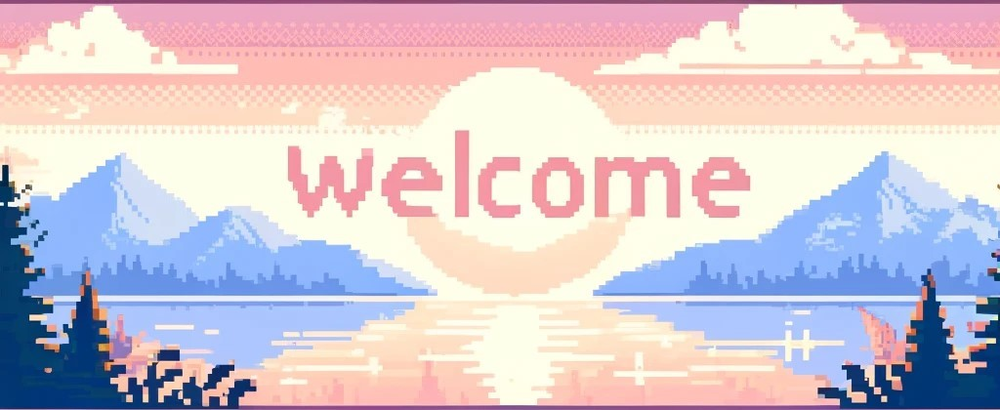

## 🚀 About Me

-  🇩🇪 27 years old German 🧙 Data Engineer
- 👷 Self-taught in **backend development** and **data engineering**
- 🛠️ Passionate about **VR** and exploring cutting-edge technologies
- 🤖 **Trained Mechatronics** turned 💾 **Data Engineer**

### 🎯 Focus

- Building scalable backend systems, developing efficient data pipelines, and constantly learning the latest in cloud technologies.

## 🌱 Ongoing Projects

- 📱 **[Gastronomy App](https://echt-gastropartner.de/app/)**: Developing a comprehensive app for the gastronomy sector at ECHT Gastropartner.
- 👓 **[Private VR Training App](https://slickcomm.de/)**: Creating a VR application to assist in the training and education of apprentices.
- ⌨️ **Wireless 3x5+3 Split Mechanical Keyboard**: Planning to build a wireless version of the custom mechanical keyboard.

## 🛠 Technologies & Tools

- **Languages**:  
  🐹   
  🌐   
  💻 

- **IDE**:  
  ✍️   
  [🔗 My Neovim Config](https://github.com/thilob97/NeoVimConfig)

- **Cloud Platforms**:  
  ☁️   
  ☁️ 

- **DevOps & Containers**:  
  🐳   
  ⚙️ 

- **3D Modeling & Game Development**:  
  🎮   
  🔧 

## 🛸 More

### 🎨 Hobbies

- **3D Printing**: Exploring various printing techniques and designs.
- **Virtual Reality (VR)**: Engaging with immersive VR experiences and technologies.

### 📚 Other Projects & Articles
- ⌨️ Build a custom **3x5+3 split handwired mechanical keyboard**
- 📎 **[Microsoft AI Lab Co-Innovation Labs](https://echt-gastropartner.de/blog/microsoft-ai-co-innovation-labs-echt-gastro-partner/)**: Participation in a workshop at the Microsoft AI Co-Innovation Lab, focusing on advancing technology in the gastronomy sector.
- 🦾 **[Showcase Project as a Final Thesis](https://www.dbregio-berlin-brandenburg.de/db-regio-no/aktuelles/punkt3/Ein-Vorzeigeprojekt-als-Abschlussarbeit-6039272)**, **[Deutsche Bahn & Niryo Robot Arm](https://www.generationrobots.com/blog/de/deutsche-bahn-niryo-roboterarm/?srsltid=AfmBOoq1U_m-iJNpMhbZxMyBKZWpX2IBaOT51f5kbg_vJhmnRDa68UMx)**: Details about a standout project completed as part of the final thesis at DB Regio.
- 🏠 **Home Automation**: Completely wired my house and made it smart using a **LOGO!** and a **Raspberry Pi**.

## 📬 Contact

- 📧 **Email**: [thilo.b@rth.pm](mailto:thilo.b@rth.pm)
- 💬 **Discord**: [Thilo#1234](https://discord.com/users/394191560205402114) 

<!--
**thilob97/thilob97** is a ✨ _special_ ✨ repository because its `README.md` (this file) appears on your GitHub profile.

Here are some ideas to get you started:

- 🔭 I’m currently working on ...
- 🌱 I’m currently learning ...
- 👯 I’m looking to collaborate on ...
- 🤔 I’m looking for help with ...
- 💬 Ask me about ...
- 📫 How to reach me: ...
- 😄 Pronouns: ...
- ⚡ Fun fact: ...
-->
